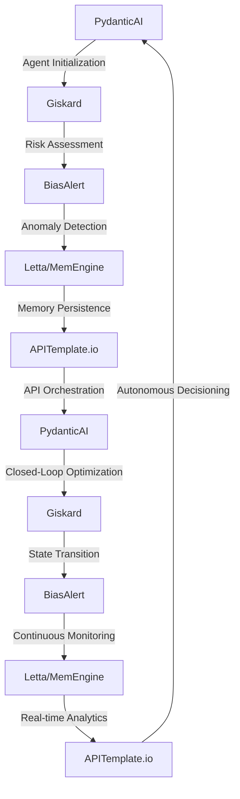

# Autonomous Supply Chain Resilience Engine
> "Fortifying the backbone of global commerce with AI-driven predictive resilience"

## 🏗️ Technical Architecture & Multi-Agent Flow

This intricate dance of agents and tools enables the Autonomous Supply Chain Resilience Engine to navigate the complexities of modern logistics.

## 🔍 The Vertical Bottleneck: Supply Chain Fragility
The warehousing and storage industry is plagued by a multitude of risks, including inventory discrepancies, transportation disruptions, and demand fluctuations. These risks can have a ripple effect throughout the entire supply chain, leading to significant financial losses and reputational damage. The technical friction at the heart of this problem lies in the inability to accurately predict and mitigate these risks in real-time. Traditional methods rely on manual data analysis and static forecasting models, which are no match for the dynamic and interconnected nature of modern supply chains.

The high-stakes mathematical failures that can occur in this domain are numerous. For instance, a single misallocated shipment can result in a cascade of delays, ultimately leading to stockouts and lost sales. Similarly, a failure to account for seasonal demand fluctuations can lead to overstocking, resulting in wasted resources and unnecessary expenses. The operational failures that can occur are equally devastating, with consequences ranging from damaged goods to complete supply chain paralysis.

The root cause of these failures lies in the lack of a unified, AI-driven framework for predicting and mitigating supply chain risks. Current solutions rely on siloed data sources and fragmented analytics tools, which are unable to provide a comprehensive view of the supply chain. This lack of visibility and coordination hinders the ability to respond quickly and effectively to disruptions, exacerbating the problem and leading to further instability.

The technical challenges associated with addressing this problem are significant. The sheer volume and variety of data involved in supply chain management can be overwhelming, with sources ranging from sensor readings and inventory levels to weather forecasts and traffic updates. Furthermore, the complexity of modern supply chains, with their multiple stakeholders and interconnected systems, demands a high degree of agility and adaptability in any solution.

## 💡 The Solution: Autonomous Supply Chain Resilience Engine
The Autonomous Supply Chain Resilience Engine is a revolutionary platform that leverages the power of PydanticAI, Giskard, BiasAlert, Letta, and APITemplate.io to predict and mitigate supply chain risks in real-time. By orchestrating these tools in a unified framework, the engine provides a comprehensive view of the supply chain, enabling proactive decision-making and minimizing the impact of disruptions.

At the heart of the engine lies a sophisticated agentic reasoning framework, which utilizes PydanticAI to analyze data from multiple sources and identify potential risks. Giskard is then employed to assess the likelihood and potential impact of these risks, while BiasAlert ensures that the analysis is free from bias and anomalies. The results are then persisted in memory using Letta/MemEngine, allowing for real-time analytics and continuous monitoring. Finally, APITemplate.io is used to orchestrate the entire process, providing a seamless and intuitive interface for users.

## 🧩 Agentic Stack Deep-Dive
The Autonomous Supply Chain Resilience Engine relies on a carefully crafted stack of libraries and tools, each chosen for its unique strengths and capabilities. PydanticAI provides the foundation for the engine's agentic reasoning framework, allowing for the analysis of complex data sources and the identification of potential risks. Giskard builds upon this foundation, providing a robust risk assessment framework that takes into account the likelihood and potential impact of identified risks.

BiasAlert is then used to ensure that the analysis is free from bias and anomalies, providing an additional layer of validation and verification. Letta/MemEngine is employed to persist the results in memory, enabling real-time analytics and continuous monitoring. Finally, APITemplate.io is used to orchestrate the entire process, providing a seamless and intuitive interface for users.

The interlocking of these tools is critical to the engine's success. PydanticAI and Giskard work in tandem to provide a comprehensive view of the supply chain, while BiasAlert ensures that the analysis is accurate and unbiased. Letta/MemEngine provides the necessary memory persistence, allowing for real-time analytics and continuous monitoring. APITemplate.io then orchestrates the entire process, providing a unified interface for users.

## ✨ Capabilities & Features
* **Real-time Risk Assessment**: The engine provides real-time risk assessment and mitigation, enabling proactive decision-making and minimizing the impact of disruptions.
* **Comprehensive Supply Chain Visibility**: The engine provides a comprehensive view of the supply chain, taking into account multiple data sources and stakeholders.
* **Agentic Reasoning Framework**: The engine utilizes a sophisticated agentic reasoning framework to analyze data and identify potential risks.
* **Bias Detection and Mitigation**: The engine includes bias detection and mitigation capabilities, ensuring that analysis is free from bias and anomalies.
* **Memory Persistence**: The engine persists results in memory, enabling real-time analytics and continuous monitoring.
* **API Orchestration**: The engine provides a seamless and intuitive interface for users, orchestrating the entire process through APITemplate.io.
* **Scalability and Flexibility**: The engine is designed to be highly scalable and flexible, accommodating the unique needs and requirements of individual supply chains.
* **Integration with Existing Systems**: The engine can be easily integrated with existing systems and tools, minimizing disruption and maximizing ROI.
* **Continuous Monitoring and Improvement**: The engine provides continuous monitoring and improvement capabilities, ensuring that the supply chain remains resilient and adaptive.
* **Customizable and Configurable**: The engine is highly customizable and configurable, allowing users to tailor the solution to their specific needs and requirements.

## 🛠️ Technical Implementation
The Autonomous Supply Chain Resilience Engine is implemented using a microservices architecture, with each component designed to be highly scalable and flexible. The engine utilizes a combination of Python and JavaScript, with PydanticAI and Giskard providing the foundation for the agentic reasoning framework.

The engine's architecture is designed to be highly modular, with each component interacting through well-defined APIs. This allows for easy integration with existing systems and tools, as well as seamless scalability and flexibility. The engine also includes a robust testing framework, ensuring that the solution is thoroughly validated and verified before deployment.

## 📊 Business Impact & ROI
The Autonomous Supply Chain Resilience Engine has the potential to significantly impact the bottom line of companies in the warehousing and storage industry. By providing real-time risk assessment and mitigation, the engine can help minimize the impact of disruptions and reduce the likelihood of stockouts and overstocking.

The engine can also help companies to improve their supply chain visibility, taking into account multiple data sources and stakeholders. This can lead to improved decision-making and reduced costs, as well as increased customer satisfaction and loyalty. Furthermore, the engine's scalability and flexibility make it an attractive solution for companies of all sizes, from small and medium-sized enterprises to large multinational corporations.

## 🚀 Getting Started
```bash
git clone https://github.com/arvind-sundararajan/supply-chain-risk-mitigation.git
cd supply-chain-risk-mitigation
pip install -r requirements.txt
python src/main.py
```

## 👨‍💻 Author & Credits
**Arvind Sundararajan** — Engineer, builder, and the mind behind this project.
🌐 [LinkedIn](https://www.linkedin.com/in/arvind-sundara-rajan/) | Chennai, India

---
### 🙏 Acknowledgements
- The open-source community
- The Warehousing & Storage practitioners who inspired this design